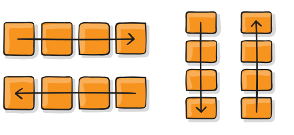

# CSS Hack

CSS hack是通过在[CSS样式](http://www.w3cschool.cn/codecamp/style-the-html-body-element.html)中加入一些特殊的符号，让**不同的浏览器**识别**不同的符号**（什么样的浏览器识别什么样的符号是有标准的，CSS hack就是让你记住这个标准），以达到应用不同的[CSS](http://www.w3cschool.cn/css)样式的目的。

# 清除浮动的方法

清除浮动的方法有**clearboth**的方法、设置**clearfix**的方法、**overflow**的方法以及给**父元素设置双伪元素**的方法

# @import

- 使用`@import`语句引入样式时，结尾需要加分号`;`
- 在`html`文档中使用`@import`时，需要在`style`标签里面
- 不推荐使用@import语句
  - `@import`引入的 CSS 将在页面加载完毕后被加载
  - `@import`是 CSS2.1 才有的语法，故只可在 IE5+ 才能识别

# CSS3新特性

css3的新特征:

1. 选择器。
2. 和透明度。
3. 多栏布局。
4. 多背景图。
5. Word Wrap。
6. 文字阴影。
7. @font-face属性。
8. 圆角(边框半径)。
9. 边框图片。
10. 盒阴影。
12.  盒子大小。
13. 媒体查询。
14. 语音。

# CSS3 :nth-child() 选择器

**定义和用法**

:nth-child(*n*) 选择器匹配属于其父元素的第 N 个子元素，不论元素的类型。

*n* 可以是数字、关键词或公式。

Odd 和 even 是可用于匹配下标是奇数或偶数的子元素的关键词（第一个子元素的下标是 1）。

在这里，我们为奇数和偶数 p 元素指定两种不同的背景色：

```css
p:nth-child(odd)
{
background:#ff0000;
}
p:nth-child(even)
{
background:#0000ff;
}
```

使用公式 (*an* + *b*)。描述：表示周期的长度，n 是计数器（从 0 开始），b 是偏移值。

在这里，我们指定了下标是 3 的倍数的所有 p 元素的背景色：

```css
p:nth-child(3n+0)
{
background:#ff0000;
}
```

first-child 是第一个元素。

# CSS 布局 - 浮动和清除

**float** 属性规定元素如何浮动。

**clear** 属性规定哪些元素可以在清除的元素旁边以及在哪一侧浮动。

float 属性用于定位和格式化内容，例如让图像向左浮动到容器中的文本那里。

float 属性可以设置以下值之一：

- left - 元素浮动到其容器的左侧
- right - 元素浮动在其容器的右侧
- none - 元素不会浮动（将显示在文本中刚出现的位置）。默认值。
- inherit - 元素继承其父级的 float 值

**clearfix Hack**

如果一个元素比包含它的元素高，并且它是浮动的，它将“溢出”到其容器之外：

然后我们可以向包含元素添加 overflow: auto;，来解决此问题：

# CSS transition 属性

把鼠标指针放到 div 元素上，其宽度会从 100px 逐渐变为 300px：

```
div
{
width:100px;
transition: width 2s;
-moz-transition: width 2s; /* Firefox 4 */
-webkit-transition: width 2s; /* Safari 和 Chrome */
-o-transition: width 2s; /* Opera */
}
```

**定义和用法**

transition 属性是一个简写属性，用于设置四个过渡属性：默认值：all 0 ease 0

| 值                                                           | 描述                                |
| :----------------------------------------------------------- | :---------------------------------- |
| [transition-property](https://www.w3school.com.cn/cssref/pr_transition-property.asp) | 规定设置过渡效果的 CSS 属性的名称。 |
| [transition-duration](https://www.w3school.com.cn/cssref/pr_transition-duration.asp) | 规定完成过渡效果需要多少秒或毫秒。  |
| [transition-timing-function](https://www.w3school.com.cn/cssref/pr_transition-timing-function.asp) | 规定速度效果的速度曲线。            |
| [transition-delay](https://www.w3school.com.cn/cssref/pr_transition-delay.asp) | 定义过渡效果何时开始。              |

# CSS Flexbox 属性


在flex布局中，flex 项（就是子元素）要么按照 `main axis`(主轴)（从 `main-start` 到 `main-end` ）排布，要么按照`cross axis`(交叉轴) (从 `cross-start` 到`cross-end`)排布。

- **main axis**: flex 容器的主轴，flex 项沿着主轴排布，注意主轴不一定是水平的，主轴是水平还是垂直取决于 `flex-direction` 属性（见下文）。
- **main-start|main-end**: 分别表示主轴的开始位置和结束位置，flex 项在容器中会从 main-start 到 main-end 排布。
- **main size**: flex 项占据主轴的宽度或高度。flex 项的 main size 属性是要么是“宽度”，要么是“高度”，这取决于主轴方向。
- **cross axis**: 垂直于主轴的轴线称为交叉轴，其方向取决于主轴方向。
- **cross-start|cross-end**: 分别表示交叉轴的开始位置和结束位置。flex 项在交叉轴上的排布从 cross-start 开始位置到 cross-end 结束位置。
- **cross size**: flex 项占据交叉轴的宽度或高度。flex 项的 cross size 属性是要么是“宽度”，要么是“高度”，这取决于交叉轴方向。

下表列出了与 flexbox 一起使用的 CSS 属性：

| 属性                                                         | 描述                                                         |
| :----------------------------------------------------------- | :----------------------------------------------------------- |
| [display](https://www.w3school.com.cn/cssref/pr_class_display.asp) | 规定用于 HTML 元素的盒类型。                                 |
| [flex-direction](https://www.w3school.com.cn/cssref/css3_pr_flex-direction.asp) | 规定弹性容器内的弹性项目的方向。row \| row-reverse \| column \| column-reverse;  |
| [justify-content](https://www.w3school.com.cn/cssref/css3_pr_justify-content.asp) | 当弹性项目没有用到主轴上的所有可用空间时，水平对齐这些项目。**`flex-start`** (默认值) : flex 项从主轴的开始位置（main-start）开始排布。 |
| [align-items](https://www.w3school.com.cn/cssref/css3_pr_align-items.asp) | 当弹性项目没有用到主轴上的所有可用空间时，垂直对齐这些项。**`stretch`** (默认值) |
| [flex-wrap](https://www.w3school.com.cn/cssref/css3_pr_flex-wrap.asp) | 规定弹性项目是否应该换行，若一条 flex 线上没有足够的空间容纳它们。nowrap \| wrap \| wrap-reverse; |
| [align-content](https://www.w3school.com.cn/cssref/css3_pr_align-content.asp) | 修改 flex-wrap 属性的行为。与 align-items 相似，但它不对齐弹性项目，而是对齐 flex 线。 |
| [flex-flow](https://www.w3school.com.cn/cssref/css3_pr_flex-flow.asp) | flex-direction 和 flex-wrap 的简写属性。                     |
| [order](https://www.w3school.com.cn/cssref/css3_pr_order.asp) | 规定弹性项目相对于同一容器内其余弹性项目的顺序。             |
| [align-self](https://www.w3school.com.cn/cssref/css3_pr_align-self.asp) | 用于弹性项目。覆盖容器的 align-items 属性。                  |
| [flex](https://www.w3school.com.cn/cssref/pr_flex.asp)       | flex-grow、flex-shrink 以及 flex-basis 属性的简写属性。      |

# BFC

BFC是一个独立的布局环境，其中的元素布局是不受外界的影响，并且在一个BFC中，块盒与行盒（行盒由一行中所有的内联元素所组成）都会垂直的沿着其父元素的边框排列。

## BFC的布局规则

- 内部的Box会在垂直方向，一个接一个地放置。
- Box垂直方向的距离由margin决定。属于同一个BFC的两个相邻Box的margin会发生重叠。
- 每个盒子（块盒与行盒）的margin box的左边，与包含块border box的左边相接触(对于从左往右的格式化，否则相反)。即使存在浮动也是如此。
- BFC的区域不会与float box重叠。
- BFC就是页面上的一个隔离的独立容器，容器里面的子元素不会影响到外面的元素。反之也如此。
- 计算BFC的高度时，浮动元素也参与计算。

## 如何创建BFC

- float的值不是none。
- position的值不是static或者relative。
- display的值是inline-block、table-cell、flex、table-caption或者inline-flex
- overflow的值不是visible

# CSS animation 属性

## keyframe

```
@keyframes animationname {keyframes-selector {css-styles;}}
```

| 值                   | 描述                                                         |
| :------------------- | :----------------------------------------------------------- |
| *animationname*      | 必需。定义动画的名称。                                       |
| *keyframes-selector* | 必需。动画时长的百分比。合法的值：0-100%from（与 0% 相同）to（与 100% 相同） |
| *css-styles*         | 必需。一个或多个合法的 CSS 样式属性。                        |

| 值                                                           | 描述                                     |
| :----------------------------------------------------------- | :--------------------------------------- |
| *[animation-name](https://www.w3school.com.cn/cssref/pr_animation-name.asp)* | 规定需要绑定到选择器的 keyframe 名称。。 |
| *[animation-duration](https://www.w3school.com.cn/cssref/pr_animation-duration.asp)* | 规定完成动画所花费的时间，以秒或毫秒计。 |
| *[animation-timing-function](https://www.w3school.com.cn/cssref/pr_animation-timing-function.asp)* | 规定动画的速度曲线。                     |
| *[animation-delay](https://www.w3school.com.cn/cssref/pr_animation-delay.asp)* | 规定在动画开始之前的延迟。               |
| *[animation-iteration-count](https://www.w3school.com.cn/cssref/pr_animation-iteration-count.asp)* | 规定动画应该播放的次数。                 |
| *[animation-direction](https://www.w3school.com.cn/cssref/pr_animation-direction.asp)* | 规定是否应该轮流反向播放动画。           |