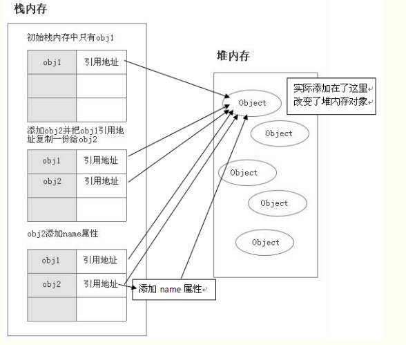
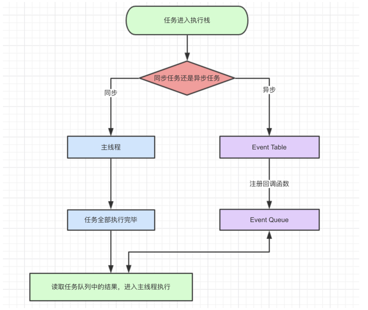
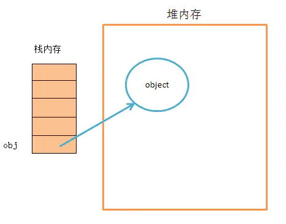
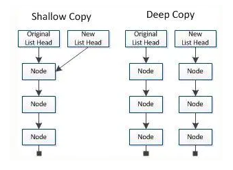
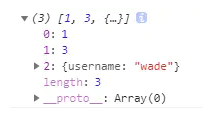
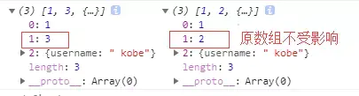
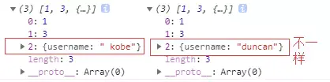

# JavaScript基本数据类型及判断方式

## 一、js基本数据类型

JavaScript的数据类型分为两种：原始类型（即基本数据类型）和对象类型（即引用数据类型）。

### 基本数据类型（又称值类型）

- String 字符串:
  - 特点：用双引号或单引号多包裹的内容。如：”123”; “张三”;
  - 注意：单双引号嵌套    双引号作为字符， ‘ ”” ’;单引号作为字符， “ ‘’ ”;
- Number 数字：
  - 特点：直接的数字 如：1; 3.14; -1; 0; NaN;  正常的数字：正数、负数、0   不正常的数字：NaN
- Boolean 布尔：
  - 特点：只有两个值true 和false如：true; false;
- Undefined 未定义：
  - 特点：只有一个值 undefined。当变量未赋值时，默认值就是undefined。如：var a; 
- Null 空对象:
  - 特点：类型称为Null,但实际的类型是object。和垃圾回收机制有关系。如：var a = null; 
- symbol（ES6 引入了一种新的原始数据类型 Symbol ，表示独一无二的值，最大的用法是用来定义对象的唯一属性名。）；

### 引用数据类型（又称对象类型）

也就是对象类型Object type，比如：Object 、Array 、Function 、Data等。特殊Array 、Function

javascript的**引用数据类型**是保存在**堆内存**中的**对象**。

与其他语言的不同是，你**不可以直接访问堆内存空间**中的位置和操作堆内存空间。**只能操作对象**在**栈内存中**的**引用地址**。

所以，**引用类型数据在栈内存中保存的实际上是对象在堆内存中的引用地址**。**通过这个引用地址可以快速查找到保存中堆内存中的对象**。

```js
var obj1 = new Object();
var obj2 = obj1;
obj2.name = "我有名字了";
console.log(obj1.name); // 我有名字了
```


说明这两个引用数据类型指向了同一个堆内存对象。obj1赋值给onj2，实际上这个堆内存对象在栈内存的引用地址复制了一份给了obj2



### 基本数据类型和引用数据类型的区别

认识内存的两个基本结构：内存可以分为栈区和堆区

- 栈区特点:是存放基本数据类型的数据和变量名；

- 堆区特点:存放引用类型数据类型的数据。

区别：**基本数据**类型的数据在复制时，复制的数据会在内存的栈区中克隆一份新的数据，并将**新的数据的新的地址和新的变量产生关联**。
**引用数据**类型的数据在复制时，复制的数据在**堆区中不会被重新克隆**，而是仅仅**克隆一份原数据的地址**给新的变量。

```js
let a=1,b=1,c={},d={}
a==b // true 基本类型
c==d // false 引用类型

// 相同参数 Symbol() 返回的值不相等
let sy1 = Symbol("kk"); 
sy === sy1;       // false
```

## 二、判断方式

### typeof 判断（最常用）

**不能区分：null与对象，一般对象与数组**

`typeof `是 JS 提供的一个运算符，专门用来检测一个变量的类型 。` typeof `有2种使用方式：typeof(表达式)和typeof 变量名，第一种是对表达式做运算，第二种是对变量做运算。

```js
function` `doSomething() {``console.log(``'Hello World!'``);}
console.log(``typeof` `1); ``// number
console.log(``typeof` `'Hello'``); ``// string
console.log(``typeof` `[]); ``// object
console.log(``typeof` `{}); ``// object
console.log(``typeof` `doSomething); ``// function
console.log(``typeof` `true``); ``// boolean
console.log(``typeof` `new` `Date()); ``// object
console.log(``typeof` `new` `RegExp()); ``// object
console.log(``typeof` `JSON.stringify({``name: ``'zhencanhua'})); ``// string
console.log(``typeof` `null``); ``// object
console.log(``typeof` `undefined); ``// undefined
console.log(``typeof` `(``new` `Error(``'error!'``))); ``// object
console.log(``typeof` `a); ``// undefined
console.log(``typeof` `Symbol()); ``// symbol
console.log(``typeof` `new` `Set()); ``// object
console.log(``typeof` `new` `Map()); ``// object
```

### instanceof 判断（了解）

**专门用来判断对象数据的类型：object，array与function**

`instanceof` 用来检测构造函数的 `prototype` 属性是否出现在某个实例对象的原型链上。 语法：object（实例对象） instanceof constructor（构造函数）。是的话返回 true，否则返回 false。所以， `instanceof` 运算符只能用作对象的判断。 针对 `typeof` 不能判断的引用型数据，我们可以使用 `instanceof` 运算符。

从上面的判断可以看出，`instanceof `的使用限制很多，而且还不能很清晰方便的判断出一个实例是数组还是对象或方法。

针对上面方法的弊端，我们可以使用 Object.prototype上的原生toString()方法来检测数据的类型。

### Object.prototype.toString.call() 判断（最靠谱）

Object 是 JS 提供的原生对象， Object.prototype.toString对任何变量都会返回这样一个字符串"[object class]"，class 就是 JS 内置对象的构造函数的名字。 call是用来改变调用函数作用域的。

Object.prototype.toString() 在toString方法被调用时执行下面的操作步骤：

1. 获取this对象的[[Class]]属性的值。（所以使用call来改变this的指向）
2. 将字符串"[object "，第一步获取的值, 以及 "]"拼接成新的字符串并返回。

[[Class]]是一个内部属性,所有的对象(原生对象和宿主对象)都拥有该属性。在规范中，[[Class]]是这么定义的: 内部属性的描述， [[Class]] 是一个字符串值，表明了该对象的类型。

### constructor 判断（比较常用）

每一个对象实例都可以通过 `constrcutor` 对象来访问它的构造函数 。JS 中内置了一些构造函数：Object、Array、Function、Date、RegExp、String等。我们可以通过数据的` constrcutor `是否与其构造函数相等来判断数据的类型。

# JavaScript数字浮点转化

JS的基础类型Number，遵循 [IEEE 754](https://en.wikipedia.org/wiki/IEEE_floating_point) 规范，采用双精度存储（double precision），占用 64 bit。


意义

- 1位用来表示符号位
- 11位用来表示指数
- 52位表示尾数

浮点数，比如

0.1 >> 0.0001 1001 1001 1001…（1001无限循环）

0.2 >> 0.0011 0011 0011 0011…（0011无限循环）

此时只能模仿十进制进行四舍五入了，但是二进制只有 0 和 1 两个，于是变为 0 舍 1 入。这即是计算机中部分浮点数运算时出现误差，丢失精度的根本原因。

大整数的精度丢失和浮点数本质上是一样的，尾数位最大是 52 位，因此 JS 中能精准表示的最大整数是 Math.pow(2, 53)，十进制即 9007199254740992。

大于 9007199254740992 的可能会丢失精度。

**一、代码**

```cpp
console.log(0.1+0.2);
console.log(0.1+0.2==0.3)
```

**二、结果：**
0.30000000000000004 （中间15个0）
false
**三、原因**
浮点类型从二进制转成10进制后带来的误差

# JavaScript设计模式

- 单例模式

  - 单例模式也称为单体模式，规定一个类只有一个实例，并且提供可全局访问点

- 适配器模式

  - 适配器模式 将一个对象或者类的接口翻译成某个指定的系统可以使用的另外一个接口。

    适配器基本上允许本来由于接口不兼容而不能一起正常工作的对象或者类能够在一起工作.适配器将对它接口的调用翻译成对原始接口的调用，而实现这样功能的代码通常是最简的。

- 代理模式

  - 在我们需要在一个对象后多次进行访问控制访问和上下文，代理模式是非常有用处的。

    当实例化一个对象开销很大的时候，它可以帮助我们控制成本，提供更高级的方式去关联和修改对象，就是在上下文中运行一个特别的方法。

    在jQuery核心中，一个jQUery.proxy()方法在接受一个函数的输入和返回一个一直具有特殊上下文的新的实体时存在。这确保了它在函数中的值时我们所期待的的值。

- 发布-订阅模式

  -  订阅发布模式定义了一种一对多的依赖关系，让多个订阅者对象同时监听某一个主题对象。这个主题对象在自身状态变化时，会通知所有订阅者对象，使它们能够自动更新自己的状态。

- 策略模式

  - 在策略模式（Strategy Pattern）中，一个类的行为或其算法可以在运行时更改。这种类型的设计模式属于行为型模式。
  - 定义一系列的算法,把它们一个个封装起来, 并且使它们可相互替换

- 迭代器模式

  - 迭代器模式（Iterator），提供一种方法顺序访问一个聚合对象中的各种元素，而又不暴露该对象的内部表示。

# EventLoop

## 1、关于javascript

javascript是一门**单线程**语言，虽然HTML5提出了Web-works这样的多线程解决方案，但是并没有改变JaveScript是单线程的本质。

> 什么是H5 Web Works？
>
> 就是将一些大计算量的代码交由web Worker运行而不冻结用户界面，但是子线程完全受主线程控制，且不得操作DOM。所以，这个新标准并没有改变JavaScript单线程的本质

## 2、javascript事件循环

既然js是单线程的，就是同一时间只能做一件事情。那么问题来了，我们访问一个页面，这个页面的初始化代码运行时间很长，比如有很多图片、视频、外部资源等等，难道我们也要一直在那等着吗？答案当然是 不能

所以就出现了两类任务：

- 同步任务

- 异步任务

  

1. 同步和异步任务分别进入不同的 '‘场所'’ 执行。所有同步任务都在主线程上执行，形成一个执行栈；而异步任务进入Event Table并注册回调函数
2. 当这个异步任务有了运行结果，Event Table会将这个回调函数移入Event Queue，进入等待状态
3. 当主线程内同步任务执行完成，会去Event Queue读取对应的函数，并结束它的等待状态，进入主线程执行
4. 主线程不断重复上面3个步骤，也就是常说的Event Loop(事件循环)。

> 那么我们怎么知道什么时候主线程是空的呢？
>
> js引擎存在monitoring process进程，会持续不断的检查主线程执行栈是否为空，一旦为空，就会去Event Queue那里检查是否有等待被调用的函数。

# [JavaScript 内存机制](https://www.cnblogs.com/liangyin/p/7764232.html)

## 内存模型

JS内存空间分为**栈(stack)**、**堆(heap)**、**池(一般也会归类为栈中)**。
其中**栈**存放变量，**堆**存放复杂对象，**池**存放常量。

## 基础数据类型与栈内存

JS中的基础数据类型，这些值都有固定的大小，往往都保存在栈内存中（闭包除外），由系统自动分配存储空间。我们可以直接操作保存在栈内存空间的值，因此基础数据类型都是按值访问
数据在栈内存中的存储与使用方式类似于数据结构中的堆栈数据结构，遵循后进先出的原则。
基础数据类型： `Number` `String` `Null` `Undefined` `Boolean`
复习一下，此问题常常在面试中问到，然而答不出来的人大有人在 ~ ~
要简单理解栈内存空间的存储方式，我们可以通过类比乒乓球盒子来分析。

| 乒乓球盒子 |
| :--------: |
|     5      |
|     4      |
|     3      |
|     2      |
|     1      |

这种乒乓球的存放方式与栈中存取数据的方式如出一辙。处于盒子中最顶层的乒乓球5，它一定是最后被放进去，但可以最先被使用。而我们想要使用底层的乒乓球1，就必须将上面的4个乒乓球取出来，让乒乓球1处于盒子顶层。这就是栈空间先进后出，后进先出的特点。

## 内存的生命周期

JS环境中分配的内存一般有如下生命周期：

1. 内存分配：当我们申明变量、函数、对象的时候，系统会自动为他们分配内存
2. 内存使用：即读写内存，也就是使用变量、函数等
3. 内存回收：使用完毕，由垃圾回收机制自动回收不再使用的内存

# 事件冒泡

不同之处：

- 标准的W3C方式：e.stopPropagation()；这里的stopPropagation是标准的事件对象的一个方法，调用即可
- 非标准的IE方式：ev.cancelBubble=true；这里的cancelBubble是IE事件对象的属性，设为true就可以了
- `Event.cancelBubble`属性是一个布尔值，如果设为`true`，相当于执行`Event.stopPropagation()`，可以阻止事件的传播。

# DOM事件模型

## 监听函数

浏览器的事件模型，就是通过监听函数（listener）对事件做出反应。事件发生后，浏览器监听到了这个事件，就会执行对应的监听函数。这是事件驱动编程模式（event-driven）的主要编程方式。

- [HTML 的 on- 属性](https://wangdoc.com/javascript/events/model.html#html-的-on--属性)

- [元素节点的事件属性](https://wangdoc.com/javascript/events/model.html#元素节点的事件属性)

- [EventTarget.addEventListener()](https://wangdoc.com/javascript/events/model.html#eventtargetaddeventlistener)

- [小结](https://wangdoc.com/javascript/events/model.html#小结)

  - 上面三种方法，第一种“HTML 的 on- 属性”，违反了 HTML 与 JavaScript 代码相分离的原则，将两者写在一起，不利于代码分工，因此不推荐使用。

    第二种“元素节点的事件属性”的缺点在于，同一个事件只能定义一个监听函数，也就是说，如果定义两次`onclick`属性，后一次定义会覆盖前一次。因此，也不推荐使用。

    第三种`EventTarget.addEventListener`是推荐的指定监听函数的方法。它有如下优点：

    - 同一个事件可以添加多个监听函数。
    - 能够指定在哪个阶段（捕获阶段还是冒泡阶段）触发监听函数。
    - 除了 DOM 节点，其他对象（比如`window`、`XMLHttpRequest`等）也有这个接口，它等于是整个 JavaScript 统一的监听函数接口。

## [this 的指向](https://wangdoc.com/javascript/events/model.html#this-的指向)

- 监听函数内部的`this`指向触发事件的那个元素节点。

## [事件的传播](https://wangdoc.com/javascript/events/model.html#事件的传播)

- 一个事件发生后，会在子元素和父元素之间传播（propagation）。这种传播分成三个阶段。

  - **第一阶段**：从`window`对象传导到目标节点（上层传到底层），称为“捕获阶段”（capture phase）。
  - **第二阶段**：在目标节点上触发，称为“目标阶段”（target phase）。
  - **第三阶段**：从目标节点传导回`window`对象（从底层传回上层），称为“冒泡阶段”（bubbling phase）。

  这种三阶段的传播模型，使得同一个事件会在多个节点上触发。

## [事件的代理](https://wangdoc.com/javascript/events/model.html#事件的代理)

- 由于事件会在冒泡阶段向上传播到父节点，因此可以把子节点的监听函数定义在父节点上，由父节点的监听函数统一处理多个子元素的事件。这种方法叫做事件的代理（delegation）。

# 闭包的作用

闭包是一种保护私有变量的机制，在函数执行时形成私有的作用域，保护里面的私有变量不受外界干扰。

# setTimeout()和setInterval()

`setTimeout`函数接受两个参数，第一个参数`func|code`是将要推迟执行的**函数名**或者**一段代码**，第二个参数`delay`是推迟执行的毫秒数。

- 需要注意的地方，如果**回调函数**是**对象的方法**，那么`setTimeout`使得**方法内部**的**`this`**关键字**指向全局环境**，**而不是**定义时所在的那个**对象**。

# 深拷贝和浅拷贝

- **深拷贝**和**浅拷贝**是**变量**在**内存中的存放位置不同**(栈，堆)
- 在js中，**对象和数组**这种**复杂的数据结构**是放在**堆中**，**堆的地址**放在**栈中**
- js中的**number，string，bool简单类型**是放在**栈**中
- **栈**的**存取速度比堆快**，但是**不适合存入复杂数据结构**
- 一般直接**存放在栈**里的变量对应**深拷贝**，**放在堆里**的变量是**浅拷贝**

## 一、数据类型

数据分为基本数据类型(String, Number, Boolean, Null, Undefined，Symbol)和对象数据类型。

1、基本数据类型的特点：直接存储在栈(stack)中的数据

2、引用数据类型的特点：**存储的是该对象在栈中引用，真实的数据存放在堆内存里**

引用数据类型在栈中存储了指针，该指针指向堆中该实体的起始地址。当解释器寻找引用值时，会首先检索其在栈中的地址，取得地址后从堆中获得实体。

堆内存

## 二、浅拷贝与深拷贝

**深拷贝和浅拷贝是只针对Object和Array这样的引用数据类型的**。

深拷贝和浅拷贝的示意图大致如下：



示意图

**浅拷贝只复制指向某个对象的指针，而不复制对象本身，新旧对象还是共享同一块内存。但深拷贝会另外创造一个一模一样的对象，新对象跟原对象不共享内存，修改新对象不会改到原对象。**


## 三、赋值和浅拷贝的区别

当我们把一个对象赋值给一个新的变量时，**赋的其实是该对象的在栈中的地址，而不是堆中的数据**。也就是**两个对象指向**的是**同一个存储空间**，无论哪个对象发生改变，其实都是改变的存储空间的内容，因此，**两个对象是联动**的。

**浅拷贝**是按位拷贝对象，**它会创建一个新对象**，这个对象有着原始对象属性值的一份精确拷贝。如果属性是基本类型，拷贝的就是基本类型的值；如果属性是内存地址（引用类型），拷贝的就是内存地址 ，因此如果其中一个对象改变了这个地址，就会影响到另一个对象。即**默认拷贝构造函数**只是对对象进行**浅拷贝复制**(逐个成员依次拷贝)，即**只复制对象空间而不复制资源**。

## 四、浅拷贝的实现方式

### 1. Object.assign()

`Object.assign()` 方法可以把任意多个的源对象自身的可枚举属性拷贝给目标对象，然后返回目标对象。但是 `Object.assign()` 进行的是浅拷贝，拷贝的是对象的属性的引用，而不是对象本身。

```js
var obj = { a: {a: "kobe", b: 39} };
var initalObj = Object.assign({}, obj);
initalObj.a.a = "wade";
console.log(obj.a.a); // wade
```

注意：**当object只有一层的时候，是深拷贝**

```js
let obj = {
   username: 'kobe'
};
let obj2 = Object.assign({},obj);
obj2.username = 'wade';
console.log(obj);//{username: "kobe"}
```

### 2. Array.prototype.concat()

```js
let arr = [1, 3, {
   username: 'kobe'
}];
let arr2=arr.concat();    
arr2[2].username = 'wade';
console.log(arr);
```

修改新对象会改到原对象：


### 3. Array.prototype.slice()

```js
let arr = [1, 3, {
   username: ' kobe'
}];
let arr3 = arr.slice();
arr3[2].username = 'wade'
console.log(arr);
```

同样修改新对象会改到原对象：



关于Array的slice和concat方法的补充说明：Array的slice和concat方法不修改原数组，只会返回一个浅复制了原数组中的元素的一个新数组。

原数组的元素会按照下述规则拷贝：

1. 如果该元素是个对象引用(不是实际的对象)，slice 会拷贝这个对象引用到新的数组里。两个对象引用都引用了同一个对象。如果被引用的对象发生改变，则新的和原来的数组中的这个元素也会发生改变。
2. 对于字符串、数字及布尔值来说（不是 String、Number 或者 Boolean 对象），slice 会拷贝这些值到新的数组里。在别的数组里修改这些字符串或数字或是布尔值，将不会影响另一个数组。

可能这段话晦涩难懂，我们举个例子，将上面的例子小作修改：

```js
let arr = [1, 3, {
   username: ' kobe'
}];
let arr3 = arr.slice();
arr3[1] = 2
console.log(arr,arr3);
```



## 五、深拷贝的实现方式

### 1. JSON.parse(JSON.stringify())

```js
let arr = [1, 3, {
   username: ' kobe'
}];
let arr4 = JSON.parse(JSON.stringify(arr));
arr4[2].username = 'duncan';
console.log(arr, arr4)
```



原理： 用JSON.stringify将对象转成JSON字符串，再用JSON.parse()把字符串解析成对象，一去一来，新的对象产生了，而且对象会开辟新的栈，实现深拷贝。

**这种方法虽然可以实现数组或对象深拷贝，但不能处理函数。**

这是因为 `JSON.stringify()` 方法是将一个JavaScript值(对象或者数组)转换为一个 JSON字符串，不能接受函数。

### 2. 手写递归方法

递归方法实现深度克隆原理：**遍历对象、数组直到里边都是基本数据类型，然后再去复制，就是深度拷贝。**

```js
// 定义检测数据类型的功能函数
   function checkedType(target) {
     return Object.prototype.toString.call(target).slice(8, -1)
   }
   // 实现深度克隆---对象/数组
   function clone(target) {
     // 判断拷贝的数据类型
     // 初始化变量result 成为最终克隆的数据
     let result, targetType = checkedType(target)
     if (targetType === 'object') {
       result = {}
     } else if (targetType === 'Array') {
       result = []
     } else {
       return target
     }
     // 遍历目标数据
     for (let i in target) {
       // 获取遍历数据结构的每一项值。
       let value = target[i]
       // 判断目标结构里的每一值是否存在对象/数组
       if (checkedType(value) === 'Object' ||
         checkedType(value) === 'Array') { //对象/数组里嵌套了对象/数组
         // 继续遍历获取到value值
         result[i] = clone(value)
       } else { 
        // 获取到value值是基本的数据类型或者是函数。
         result[i] = value;
       }
     }
     return result
   }

   // 定义检测数据类型的功能函数
   function checkedType(target) {
     return Object.prototype.toString.call(target).slice(8, -1)
   }
   // 实现深度克隆---对象/数组
   function clone(target) {
     // 判断拷贝的数据类型
     // 初始化变量result 成为最终克隆的数据
     let result, targetType = checkedType(target)
     if (targetType === 'object') {
       result = {}
     } else if (targetType === 'Array') {
       result = []
     } else {
       return target
     }
     // 遍历目标数据
     for (let i in target) {
       // 获取遍历数据结构的每一项值。
       let value = target[i]
       // 判断目标结构里的每一值是否存在对象/数组
       if (checkedType(value) === 'Object' ||
         checkedType(value) === 'Array') { 
          // 对象/数组里嵌套了对象/数组
          // 继续遍历获取到value值
         result[i] = clone(value)
       } else { 
         // 获取到value值是基本的数据类型或者是函数。
         result[i] = value;
       }
     }
     return result
   }
```

### 3. 函数库lodash

该函数库也有提供 `_.cloneDeep` 用来做 Deep Copy。

```js
var _ = require('lodash');
var obj1 = {
   a: 1,
   b: { f: { g: 1 } },
   c: [1, 2, 3]
};
var obj2 = _.cloneDeep(obj1);
console.log(obj1.b.f === obj2.b.f);
// false
```