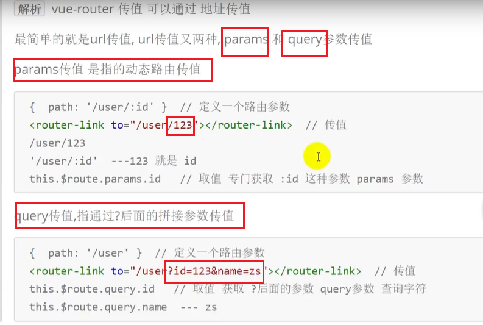
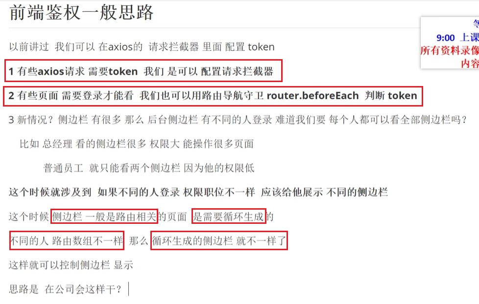
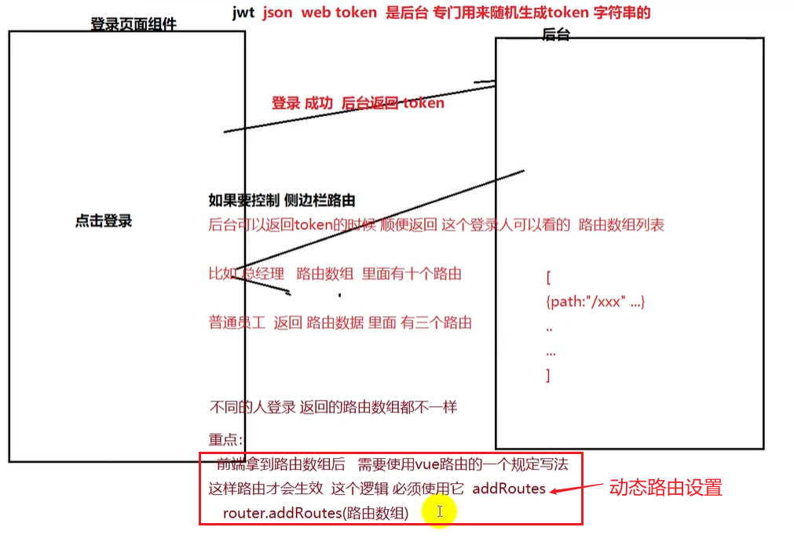
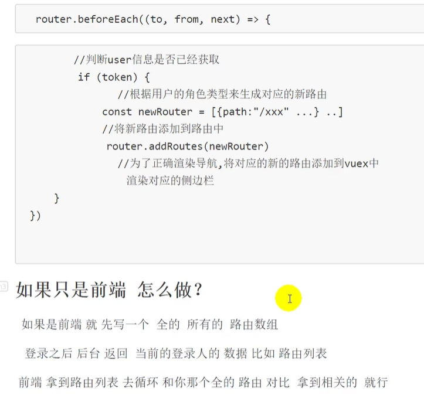

# vue-router 传值

# vue-router 动态路由

动态路由不同于常见的静态路由，可以根据不同的「因素」而改变站点路由列表。常见的动态路由大都是用来实现：多用户权限系统不同用户展示不同导航菜单。

**如何利用Vue Router 实现动态路由**

`Vue`项目实现动态路由的方式大体可分为两种：

- 前端将全部路由规定好，登录时根据用户角色权限来动态展示路由；
- 路由存储在数据库中，前端通过接口获取当前用户对应路由列表并进行渲染；

这里使用的方案是利用`Vue Router`的一些特性实现后端主导的动态路由。

**Vue Router 全局前置守卫**

[官网解释](https://router.vuejs.org/zh/guide/advanced/navigation-guards.html#全局前置守卫)

这里主要借助全局前置守卫的「前置」特性，在页面加载前将当前用户所用到的路由列表注入到`Router`实例中，注入使用到的方法则是下面的`router.addRoutes`方法。

**Vue Router router.addRoutes 实例方法**

[官网解释](https://router.vuejs.org/zh/api/#router-addroutes)

`router.addRoutes`方法可以为`Router`实例动态添加路由规则，刚好为实现动态路由提供了注入方法。

**Vue Router 路由懒加载**

[官网解释](https://router.vuejs.org/zh/guide/advanced/lazy-loading.html#把组件按组分块)

懒加载这个功能不是动态路由的必要功能，但既然提供了这一特性，所以就直接在项目中使用了。

**具体思路**

**基础信息准备**

前端代码实现基本静态路由，例如：登录页路由，服务器错误页路由等（这里有一个坑，后面讲）。数据库存储全部动态路由信息。

数据库如何存储动态路由信息？我选择的方案是现将路由引用的对象字符串化，再将路由列表转化为`JSON`格式传输给后端，经后端处理后存储到数据库里。总之在前后端进行传递的是`JSON`格式的路由列表信息。

如何将路由中引用的对象字符串化？我遇到的实际问题是：使用的`UI`组件提供了布局方案，需要引用布局组件并在子路由处引用具体页面。我选择的解决方案是：区别对待需要引用布局组件的`component`属性，使用简短字符串代替布局组件，使用文件路径字符串代替页面引入。

