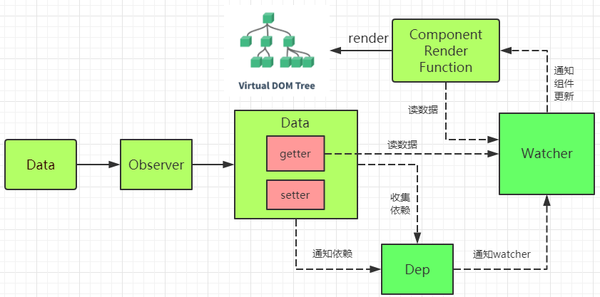
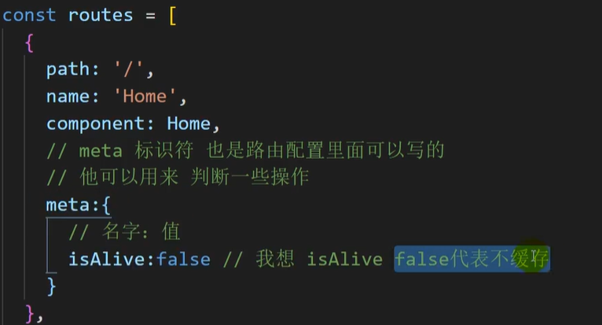
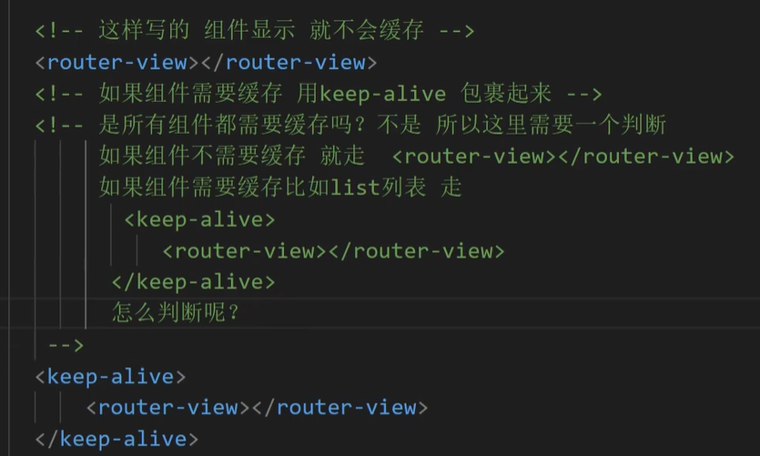
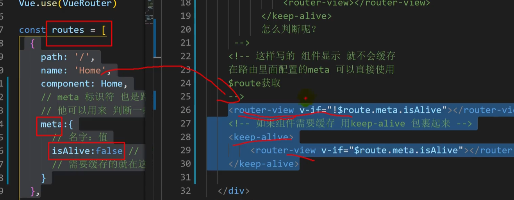
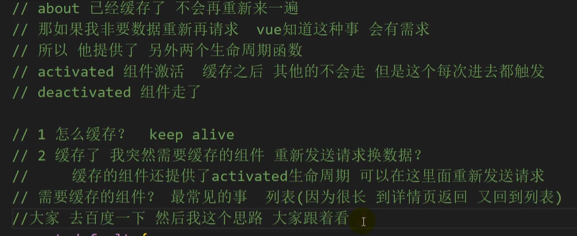
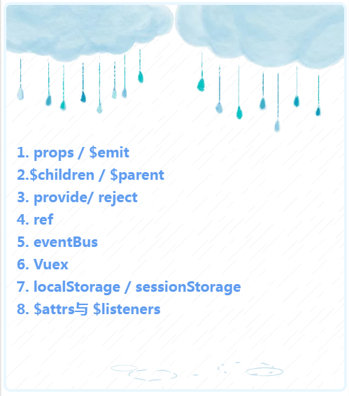
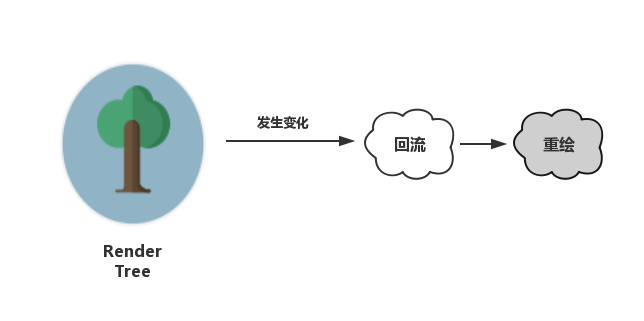

# 双向绑定

- vue.js 则是采用数据劫持结合发布者-订阅者模式的方式，通过`Object.defineProperty()`来劫持各个属性的`setter`，`getter`，在数据变动时发布消息给订阅者，触发相应的监听回调。

- vue的双向数据绑定原理
  监听器 Observer ，用来劫持并监听所有属性（转变成setter/getter形式），如果属性发生变化，就通知订阅者
  
  订阅者 Watcher，可以收到属性的变化通知并执行相应的方法，从而更新视图
  
  解析器 Compile，可以解析每个节点的相关指令，对模板数据和订阅器进行初始化
  
  订阅器 Dep，用来收集订阅者，对监听器 Observer 和 订阅者 Watcher 进行统一管理

  

- ## 核心

- 是通过Object.defineProperty() + addEventListener，对data的每个属性进行了get、set的拦截。其实只用Object.defineProperty()已经可以实现双向绑定，只是这样做效率很低

  ## 原理图

  

  vue的数据双向绑定 将MVVM作为数据绑定的入口，整合Observer，Compile和Watcher三者，通过Observer来监听自己的model的数据变化，通过Compile来解析编译模板指令（vue中是用来解析 {{}}），最终利用watcher搭起observer和Compile之间的通信桥梁，达到数据变化 —>视图更新；视图交互变化（input）—>数据model变更双向绑定效果。

  - observer用来实现对每个vue中的data中定义的属性循环用Object.defineProperty()实现数据劫持，以便利用其中的setter和getter，然后通知订阅者，订阅者会触发它的update方法，对视图进行更新。

  - 我们介绍为什么要订阅者，在vue中v-model，v-name，{{}}等都可以对数据进行显示，也就是说假如一个属性都通过这三个指令了，那么每当这个属性改变的时候，相应的这个三个指令的html视图也必须改变，于是vue中就是每当有这样的可能用到双向绑定的指令，就在一个Dep中增加一个订阅者，其订阅者只是更新自己的指令对应的数据，也就是v-model='name'和{{name}}有两个对应的订阅者，各自管理自己的地方。每当属性的set方法触发，就循环更新Dep中的订阅者。

  ## observer实现

- 主要是给每个vue的属性用Object.defineProperty()，代码如下：

  ```js
  function defineReactive (obj, key, val) {
      var dep = new Dep();
          Object.defineProperty(obj, key, {
               get: function() {
                      //添加订阅者watcher到主题对象Dep
                      if(Dep.target) {
                          // JS的浏览器单线程特性，保证这个全局变量在同一时间内，只会有同一个监听器使用
                          dep.addSub(Dep.target);
                      }
                      return val;
               },
               set: function (newVal) {
                      if(newVal === val) return;
                      val = newVal;
                      console.log(val);
                      // 作为发布者发出通知
                      dep.notify();//通知后dep会循环调用各自的update方法更新视图
               }
         })
  }
          function observe(obj, vm) {
              Object.keys(obj).forEach(function(key) {
                  defineReactive(vm, key, obj[key]);
              })
          }
  ```

  ## 实现compile

  compile的目的就是解析各种指令称真正的html。

  ```js
  function Compile(node, vm) {
      if(node) {
          this.$frag = this.nodeToFragment(node, vm);
          return this.$frag;
      }
  }
  Compile.prototype = {
      nodeToFragment: function(node, vm) {
          var self = this;
          var frag = document.createDocumentFragment();
          var child;
          while(child = node.firstChild) {
              console.log([child])
              self.compileElement(child, vm);
              frag.append(child); // 将所有子节点添加到fragment中
          }
          return frag;
      },
      compileElement: function(node, vm) {
          var reg = /\{\{(.*)\}\}/;
          //节点类型为元素(input元素这里)
          if(node.nodeType === 1) {
              var attr = node.attributes;
              // 解析属性
              for(var i = 0; i < attr.length; i++ ) {
                  if(attr[i].nodeName == 'v-model') {//遍历属性节点找到v-model的属性
                      var name = attr[i].nodeValue; // 获取v-model绑定的属性名
                      node.addEventListener('input', function(e) {
                          // 给相应的data属性赋值，进而触发该属性的set方法
                          vm[name]= e.target.value;
                      });
                      new Watcher(vm, node, name, 'value');//创建新的watcher，会触发函数向对应属性的dep数组中添加订阅者，
                  }
              };
          }
          //节点类型为text
          if(node.nodeType === 3) {
              if(reg.test(node.nodeValue)) {
                  var name = RegExp.$1; // 获取匹配到的字符串
                  name = name.trim();
                  new Watcher(vm, node, name, 'nodeValue');
              }
          }
      }
  }
  ```

  ## watcher实现

  ```js
  function Watcher(vm, node, name, type) {
      Dep.target = this;
      this.name = name;
      this.node = node;
      this.vm = vm;
      this.type = type;
      this.update();
      Dep.target = null;
  }
  
  Watcher.prototype = {
      update: function() {
          this.get();
          this.node[this.type] = this.value; // 订阅者执行相应操作
      },
      // 获取data的属性值
      get: function() {
          console.log(1)
          this.value = this.vm[this.name]; //触发相应属性的get
      }
  }
  ```

- 首先我们为每个vue属性用Object.defineProperty()实现数据劫持，为每个属性分配一个订阅者集合的管理数组dep；然后在编译的时候在该属性的数组dep中添加订阅者，v-model会添加一个订阅者，{{}}也会，v-bind也会，只要用到该属性的指令理论上都会，接着为input会添加监听事件，修改值就会为该属性赋值，触发该属性的set方法，在set方法内通知订阅者数组dep，订阅者数组循环调用各订阅者的update方法更新视图。

# VUE3.0双向绑定

proxy方法
vue.js 是采用数据劫持结合发布者-订阅者模式的方式，通过new Proxy()来劫持各个属性的setter，getter，在数据变动时发布消息给订阅者，触发相应的监听回调。

Vue 3.0与Vue 2.0的区别仅是**数据劫持的方式**由Object.defineProperty**更改为Proxy代理**，其他代码不变。

## 1. 为什么要替换Object.defineProperty

**替换不是因为不好，是因为有更好的方法使用效率更高**

`Object.defineProperty`的缺点：

##### 1. 在Vue中，`Object.defineProperty`无法监控到数组下标的变化，

导致直接通过数组的下标给数组设置值，不能实时响应。

```js
push()
pop()
shift()
unshift()
splice()
sort()
reverse()
```

目前只针对以上方法做了hack处理，所以恰数组属性是检测不到的，有局限性。

##### 2. Object.defineProperty只能劫持对象的属性,因此我们需要对每个对象的每个属性进行遍历。

Vue里，是通过递归以及遍历data对象来实现对数据的监控的，

如果属性值也是对象那么需要深度遍历,显然如果能劫持一个完整的对象，不管是对操作性还是性能都会有一个很大的提升。
 而要取代它的**Proxy有以下两个优点**：

> 1. 可以劫持整个对象，并返回一个新对象
> 2. 有13种劫持操作

## 2. 什么是Proxy

`Proxy`是`ES6` 中新增的一个特性， `Proxy`让我们能够以简洁易懂的方式控制外部对对象的访问。其功能非常类似于设计模式中的代理模式。

`Proxy`可以理解成，在目标对象之前架设一层“拦截”，外界对该对象的访问，都必须先通过这层拦截，因此提供了一种机制，可以对外界的访问进行过滤和改写。

使用 `Proxy`的核心优点是可以交由它来处理一些非核心逻辑（如：读取或设置对象的某些属性前记录日志；设置对象的某些属性值前，需要验证；某些属性的访问控制等）。 从而可以让对象只需关注于核心逻辑，达到关注点分离，降低对象复杂度等目的。

###### 基本用法：

```js
let p = new Proxy(target, handler);
```

###### 参数：

> target: 是用Proxy包装的被代理对象（可以是任何类型的对象，包括原生数组，函数，甚至另一个代理）。
>  handler: 是一个对象，其声明了代理target 的一些操作，其属性是当执行一个操作时定义代理的行为的函数。

`p`是`Proxy`对象，当其他操作对p进行更改的时候，会执行`handler`对象的方法。`Proxy`有13种数据劫持的操作，常用的`handler`处理方法：

> get: 读取值，
>  set: 获取值，
>  has: 判断对象是否拥有该属性，
>  construct: 构造函数

###### 举个例子：

```js
let obj = {};
 let handler = {
   get(target, property) {
    console.log(`${property} 被读取`);
    return property in target ? target[property] : 3;
   },
   set(target, property, value) {
    console.log(`${property} 被设置为 ${value}`);
    target[property] = value;
   }
 }

 let p = new Proxy(obj, handler);
 p.name = 'tom' //name 被设置为 tom
 p.age; //age 被读取 3
```

## 3. Proxy实现数据劫持

```jsx
observe(data) {
  const that = this;
  let handler = {
   get(target, property) {
      return target[property];
    },
    set(target, key, value) {
      let res = Reflect.set(target, key, value);
      that.subscribe[key].map(item => {
        item.update();
      });
      return res;
    }
  }
  this.$data = new Proxy(data, handler);
}
```

这段代码里把代理器返回的对象代理到this.data是代理后的对象，外部每次对this.$data进行操作时，实际上执行的是这段代码里handler对象上的方法。
 注：这儿用到了reflect属性，这也是ES6里面的，不知道的去这儿看看吧。[reflect属性](https://developer.mozilla.org/zh-CN/docs/Web/JavaScript/Reference/Global_Objects/Reflect)

# Reflect

**Reflect** 是一个内置的对象，它提供拦截 JavaScript 操作的方法。这些方法与[proxy handlers](https://wiki.developer.mozilla.org/en-US/docs/Web/JavaScript/Reference/Global_Objects/Proxy/handler)的方法相同。`Reflect`不是一个函数对象，因此它是不可构造的。

# keep-alive









# 组件通信方式



- **props / $emit**
  - 父组件通过props的方式向子组件传递数据，而通过$emit 子组件可以向父组件通信。
- **$children / \$parent**
  - 通过$parent和\$children就可以访问组件的实例，拿到实例代表什么？代表可以访问此组件的所有方法和data。

**上面两种方式用于父子组件之间的通信， 而使用props进行父子组件通信更加普遍; 二者皆不能用于非父子组件之间的通信。**

- **provide/ inject**
  - 是vue2.2.0新增的api, 简单来说就是父组件中通过provide来提供变量, 然后再子组件中通过inject来注入变量。
  - 注意: 这里不论子组件嵌套有多深, 只要调用了inject 那么就可以注入provide中的数据，而不局限于只能从当前父组件的props属性中回去数据
- **ref / refs**
  - ref：如果在普通的 DOM 元素上使用，引用指向的就是 DOM 元素；如果用在子组件上，引用就指向组件实例，可以通过实例直接调用组件的方法或访问数据
- **eventBus**
  - eventBus 又称为事件总线，在vue中可以使用它来作为沟通桥梁的概念, 就像是所有组件共用相同的事件中心，可以向该中心注册发送事件或接收事件， 所以组件都可以通知其他组件。
  - eventBus也有不方便之处, 当项目较大,就容易造成难以维护的灾难
- **Vuex**
  - Vuex 是一个专为 Vue.js 应用程序开发的状态管理模式。它采用集中式存储管理应用的所有组件的状态，并以相应的规则保证状态以一种可预测的方式发生变化.
  - Vuex 解决了多个视图依赖于同一状态和来自不同视图的行为需要变更同一状态的问题，将开发者的精力聚焦于数据的更新而不是数据在组件之间的传递上
  - **Vuex各个模块**
    -  state：用于数据的存储，是store中的唯一数据源
    -  getters：如vue中的计算属性一样，基于state数据的二次包装，常用于数据的筛选和多个数据的相关性计算
    -  mutations：类似函数，改变state数据的唯一途径，且不能用于处理异步事件
    -  actions：类似于mutation，用于提交mutation来改变状态，而不直接变更状态，可以包含任意异步操作
    -  modules：类似于命名空间，用于项目中将各个模块的状态分开定义和操作，便于维护
- **localStorage / sessionStorage**
  - 这种通信比较简单,**缺点是数据和状态比较混乱,不太容易维护**。
  - 通过**window.localStorage.getItem(key) 获取数据**
  - 通过**window.localStorage.setItem(key,value) 存储数据**
  - 注意用**JSON.parse() / JSON.stringify() 做数据格式转换**
  - **localStorage / sessionStorage可以结合vuex, 实现数据的持久保存**,同时使用vuex解决数据和状态混乱问题.
- **$attrs与 \$listeners**（隔代组件通信）
  -  使用props绑定来进行一级一级的信息传递, 如果D组件中状态改变需要传递数据给A, 使用事件系统一级级往上传递
  -  使用eventBus,这种情况下还是比较适合使用, 但是碰到多人合作开发时, 代码维护性较低, 可读性也低
  -  使用Vuex来进行数据管理, 但是如果仅仅是传递数据, 而不做中间处理,使用Vuex处理感觉有点大材小用了.

常见使用场景可以分为三类:

- 父子组件通信: props; $parent / children; provide / inject ; ref ; ​attrs / ​listeners
- 兄弟组件通信: eventBus ;  vuex
- 跨级通信: eventBus；Vuex；provide / inject 、$attrs / ​listeners

# watch/computed的区别

- computed是计算属性，依赖其它属性值，并且 computed 的值有缓存，只有它依赖的属性值发生改变，下一次获取 computed 的值时才会重新计算 computed 的值
- watch是观察监听的作用，类似于某些数据的监听回调 ，每当监听的数据变化时都会执行回调进行后续操作
- 当我们需要进行数值计算，并且依赖于其它数据时，应该使用 computed
- 当我们需要在数据变化时执行异步或开销较大的操作时，应该使用 watch

# v-if与v-show的区别

- v-show 只是简单的控制元素的 display 属性，而 v-if 才是条件渲染（条件为真，元素将会被渲染，条件为假，元素会被销毁）；
- v-show 有更高的首次渲染开销，而 v-if 的首次渲染开销要小的多；
- v-if 有更高的切换开销，v-show 切换开销小；
- v-if 有配套的 v-else-if 和 v-else，而 v-show 没有
- v-if 可以搭配 template 使用，而 v-show 不行
- v-show是由display样式决定，不管初始条件是什么都会渲染
- v-if 适用于不需要频繁切换条件的场景；v-show 则适用于需要非常频繁切换条件的场景

# vue中的路由模式

## history模式

- HTML5中的两个API：pushState和replaceState，改变url之后页面不会重新刷新，也不会带有#号，页面地址美观，url的改变会触发popState事件，监听该事件也可以实现根据不同的url渲染对应的页面内容
- 但是因为没有#会导致用户在刷新页面的时候，还会发送请求到服务端，为避免这种情况，需要每次url改变的时候，都将所有的路由重新定位到跟路由下

## hash模式

- url hash: http 😕/foo.com/#help
- \#后面hash值的改变，并不会重新加载页面，同时hash值的变化会触发hashchange事件，该事件可以监听，可根据不同的哈希值渲染不同的页面内容

# vue 3.0中proxy数据双向绑定

- Proxy 可以直接监听对象而非属性；
- Proxy 可以直接监听数组的变化；
- Proxy 有多达 13 种拦截方法,不限于 apply、ownKeys、deleteProperty、has 等等是 Object.defineProperty 不具备的；
- Proxy 返回的是一个新对象,我们可以只操作新的对象达到目的,而 Object.defineProperty 只能遍历对象属性直接修改；
- Proxy 作为新标准将受到浏览器厂商重点持续的性能优化，也就是传说中的新标准的性能红利；

# nextTick

## **一、原理**

1.异步说明

> Vue 实现响应式并**不是数据发生变化之后 DOM 立即变化**，而是按一定的策略进行 DOM 的更新。

2.事件循环说明

简单来说，Vue在修改数据后，视图不会立刻更新，而是等**同一事件循环**中的所有数据变化完成之后，再统一进行视图更新。

## 二、[Vue.nextTick](https://zhuanlan.zhihu.com/p/174396758/edit) 的机制

### **1、为什么用Vue.nextTick()**

首先来了解一下JS的运行机制。

JS运行机制（Event Loop）

**JS执行是单线程的，它是基于事件循环的。**

1. 所有同步任务都在主线程上执行，形成一个执行栈。
2. 主线程之外，会存在一个任务队列，只要异步任务有了结果，就在任务队列中放置一个事件。
3. 当执行栈中的所有同步任务执行完后，就会读取任务队列。那些对应的异步任务，会结束等待状态，进入执行栈。
4. 主线程不断重复第三步。

这里主线程的执行过程就是一个**`tick`**，而所有的异步结果都是通过任务队列来调度。**`Event Loop`** 分为**宏任务**和**微任务**，无论是执行宏任务还是微任务，完成后都会进入到一下**`tick`**，**并在两个`tick`之间进行UI渲染**。

由于**Vue DOM更新**是**异步执行**的，即**修改数据时**，**视图不会立即更新**，而是**会监听数据变化**，**并缓存在同一事件循环**中，**等同一数据循环中**的**所有数据**变化**完成**之后，再**统一进行视图更新**。为了**确保得到更新后的DOM**，所以**设置了 `Vue.nextTick()`方法**。

### 2、什么是Vue.nextTick()

是Vue的核心方法之一，官方文档解释如下：

> 在下次DOM更新循环结束之后执行延迟回调。在修改数据之后立即使用这个方法，获取更新后的DOM。

**MutationObserver**

先简单介绍下`MutationObserver`：MO是HTML5中的API，是一个用于监视DOM变动的接口，它可以监听一个DOM对象上发生的子节点删除、属性修改、文本内容修改等。

调用过程是要先给它绑定回调，得到MO实例，这个回调会在MO实例监听到变动时触发。这里MO的回调是放在`microtask`中执行的。

```js
// 创建MO实例
const observer = new MutationObserver(callback)

const textNode = '想要监听的Don节点'

observer.observe(textNode, {
    characterData: true // 说明监听文本内容的修改
})
```

## 3、怎么用

**语法**：`Vue.nextTick([callback, context])`

**参数**：

- `{Function} [callback]`：回调函数，不传时提供promise调用
- `{Object} [context]`：回调函数执行的上下文环境，不传默认是自动绑定到调用它的实例上。

```js
//改变数据
vm.message = 'changed'

//想要立即使用更新后的DOM。这样不行，因为设置message后DOM还没有更新
console.log(vm.$el.textContent) // 并不会得到'changed'

//这样可以，nextTick里面的代码会在DOM更新后执行
Vue.nextTick(function(){
    // DOM 更新了
    //可以得到'changed'
    console.log(vm.$el.textContent)
})

// 作为一个 Promise 使用 即不传回调
Vue.nextTick()
  .then(function () {
    // DOM 更新了
  })
```

Vue实例方法`vm.$nextTick`做了进一步封装，把context参数设置成当前Vue实例。

## 4、小结

使用`Vue.nextTick()`是为了可以获取更新后的DOM 。
触发时机：在同一事件循环中的数据变化后，DOM完成更新，立即执行`Vue.nextTick()`的回调。

> 同一事件循环中的代码执行完毕 -> DOM 更新 -> nextTick callback触发

## 应用场景：

- 在Vue生命周期的`created()`钩子函数进行的DOM操作一定要放在`Vue.nextTick()`的回调函数中。**原因**：是`created()`钩子函数执行时DOM其实并未进行渲染。
- 在数据变化后要执行的某个操作，而这个操作需要使用随数据改变而改变的DOM结构的时候，这个操作应该放在`Vue.nextTick()`的回调函数中。**原因**：Vue异步执行DOM更新，只要观察到数据变化，Vue将开启一个队列，并缓冲在同一事件循环中发生的所有数据改变，如果同一个watcher被多次触发，只会被推入到队列中一次。

# 减少DOM操作

**DOM 为什么这么慢，因为，DOM和JS的跨界交流**

JS 是很快的，在 JS 中修改 DOM 对象也是很快的。在JS的世界里，一切是简单的、迅速的。**但 DOM 操作**并非 JS 一个人的独舞，而是**两个模块之间的协作**。

**JS 引擎**和**渲染引擎（浏览器内核）**是**独立实现**的。当我们**用 JS 去操作 DOM** 时，**本质**上是 **JS 引擎和渲染引擎之间进行了“跨界交流”**。

“跨界交流”要收费——这个开销本身就是不可忽略的。我们每操作一次 DOM（不管是为了修改还是仅仅为了访问其值），都要跨界一次。跨界的次数一多，就会产生比较明显的性能问题。因此“减少 DOM 操作”的建议，并非空穴来风。

**对 DOM 的修改引发样式的更迭**
很多时候，我们对 DOM 的操作都不会局限于访问，而是为了修改它。当我们对 DOM 的修改会引发它外观（样式）上的改变时，就会触发回流或重绘。

这个过程本质上还是因为我们对 DOM 的修改触发了渲染树（Render Tree）的变化所导致的：



**回流（重排）**：当我们对 DOM 的修改引发了 DOM 几何尺寸变化（比如修改元素的宽、高或隐藏元素等）时，浏览器需要重新计算元素的几何属性（其他元素的几何属性和位置也会因此受到影响），然后再将计算的结果绘制出来。这个过程就是回流（也叫重排）。

**重绘**：当我们对 DOM 的修改导致了样式的变化、却并未影响其几何属性（比如修改了颜色或背景色）时，浏览器不需重新计算元素的几何属性、直接为该元素绘制新的样式（跳过了上图所示的回流环节）。这个过程叫做重绘。

由此我们可以看出，重绘不一定导致回流，回流一定会导致重绘。硬要比较的话，回流比重绘做的事情更多，带来的开销也更大。但这两个说到底都是吃性能的，所以都不是什么善茬。我们在开发中，要从代码层面出发，尽可能把回流和重绘的次数最小化。